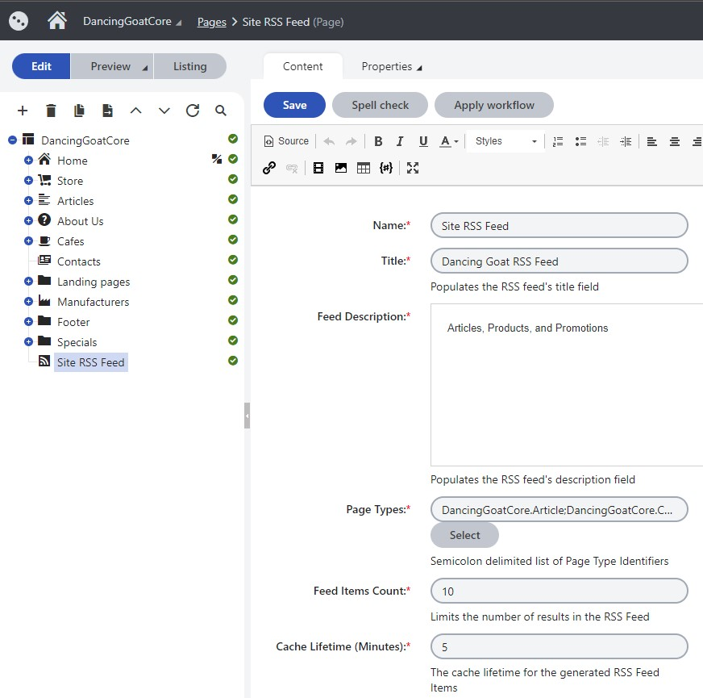
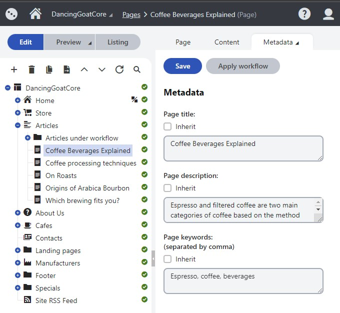
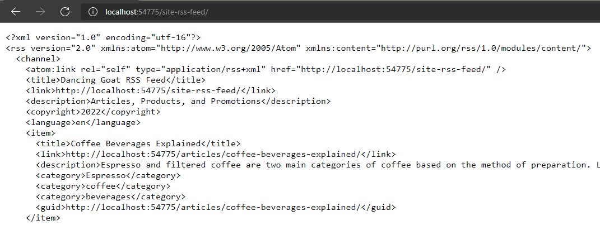

# Xperience RSS Feeds

[](https://www.nuget.org/packages/XperienceCommunity.RSSFeeds)

RSS Feed Integration for ASP.NET Core based Kentico Xperience 13.0 applications using Content Tree Routing

## Dependencies

This package is compatible with ASP.NET Core 3.1+ and is designed to be used with ASP.NET Core applications integrated with Kentico Xperience 13.0.

## How to Use?

1. [Import the Page Type definition](https://docs.xperience.io/deploying-websites/exporting-and-importing-sites/importing-a-site-or-objects) included in this repository, for the version of the package your are installing, into your Administration application:

   Example: [./src/XperienceCommunity.RSSFeeds.Import.v1.0.0.zip](./src/XperienceCommunity.RSSFeeds.Import.v1.0.0.zip)

1. Install the NuGet package in your ASP.NET Core project

   ```bash
   dotnet add package XperienceCommunity.RSSFeeds
   ```

1. Register the package's types with the `IServiceCollection`

   ```csharp
   public class Startup
   {
       public void ConfigureServices(IServiceCollection services)
       {
           services.AddRSSFeeds();
       }
   }
   ```

1. Create a new Page (anywhere) in the Content Tree for your RSS Feed and populate the required fields:

    <a href="./images/01-new-rss-page-in-content-tree.jpg">
        
    </a>

1. Optional: Create your own custom `IRSSFeedItemsRetriever` implementation:

   ```csharp
   public class CustomRSSFeedItemsRetriever : IRSSFeedItemsRetriever
   {
       // ...

       public async Task<ICollection<Item>> RetrieveAsync(string[] pageTypes, int count, CancellationToken token)
       {
           // ...
       }
   }
   ```

   Then register it with the `IServicesCollection`:

   ```csharp
   public class Startup
   {
       public void ConfigureServices(IServiceCollection services)
       {
           services.AddRSSFeeds<CustomRSSFeedItemsRetriever>();
       }
   }
   ```

## How Does It Work?

Kentico Xperience handles routing for the RSS feed using [Content Tree Routing](https://docs.xperience.io/developing-websites/implementing-routing/content-tree-based-routing).

This library provides a Controller and Page Type to connect the Content Tree Route to a dynamically generated RSS Feed.

You can create as many RSS Feed Pages as you need and select different Page Types for each of them if you want to host feeds for different content. The URL of the RSS Feed Page is the URL of the RSS Feed.

It also provides a default implementation of `IRSSFeedItemsRetriever` which uses the `DocumentPageTitle`, `DocumentPageDescription` and `DocumentPageKeywords` fields of retrieved pages to populate the RSS Feed.

The benefit of using these fields is that no SQL `UNION`s need performed to get all the necessary data if multiple Page Types are specified for the RSS Feed.

Below is an example of this metadata populated for a Page:

<a href="./images/02-article-in-content-tree-with-metadata.jpg">
    
</a>

And the resulting RSS Feed:

<a href="./images/03-example-rss-feed-content.jpg">
    
</a>

If you need to populate more of the fields for the RSS Feed Items (like Author) or you want to use something other than `DocumentLastPublished` to order the results populating the Feed, then implement your own `IRSSFeedItemsRetriever` using whatever `DocumentQuery` fits your needs.

You could even use the `RSSFeedPage` instance to populate different content for the same Page Types in different parts of the Content Tree.

## References

- [Kentico Xperience Content Tree Routing docs](https://docs.xperience.io/developing-websites/implementing-routing/content-tree-based-routing)
- [RssSyndication project on GitHub](https://github.com/shawnwildermuth/RssSyndication)

### Kentico Xperience

- [Kentico Xperience Design Patterns: MVC is Dead, Long Live PTVC](https://dev.to/seangwright/kentico-xperience-design-patterns-mvc-is-dead-long-live-ptvc-4635#building-pages-with-page-templates)
- [Filtering Page Templates](https://docs.xperience.io/developing-websites/page-builder-development/developing-page-templates/filtering-page-templates)
